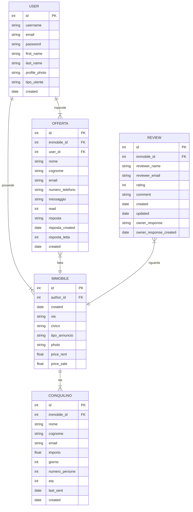

```mermaid
erDiagram
    USER ||--|{ IMMOBILE : possiede
    IMMOBILE ||--|{ COINQUILINO: sta
    OFFERTA }|--|| IMMOBILE : fatta
    REVIEW }|--|| IMMOBILE : riguarda
    USER ||--|{ OFFERTA : risponde
    USER {
        int id PK
        string username
        string email
        string password
        string first_name
        string last_name
        string profile_photo
        string tipo_utente
        date created
    }
    IMMOBILE {
        int id PK
        int author_id FK
        date created
        string via
        string civico
        string tipo_annuncio
        string photo
        float price_rent
        float price_sale
        
    }
    COINQUILINO {
        int id PK
        int immobile_id FK
        string nome
        string cognome
        string email
        float importo
        int giorno
        int numero_persone
        int eta
        date last_sent
        date created
    }
    OFFERTA {
        int id PK
        int immobile_id FK
        int user_id FK
        string nome
        string cognome
        string email
        string numero_telefono
        string messaggio
        int read
        string risposta
        date risposta_created
        int risposta_letta
        date created
    }
    REVIEW {
        int id PK
        int immobile_id FK
        string reviewer_name
        string reviewer_email
        int rating
        string comment
        date created
        date updated
        string owner_response
        date owner_response_created
    }
```